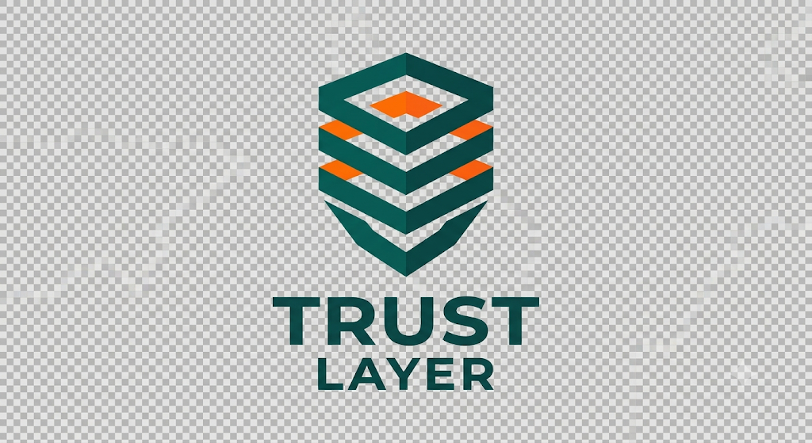
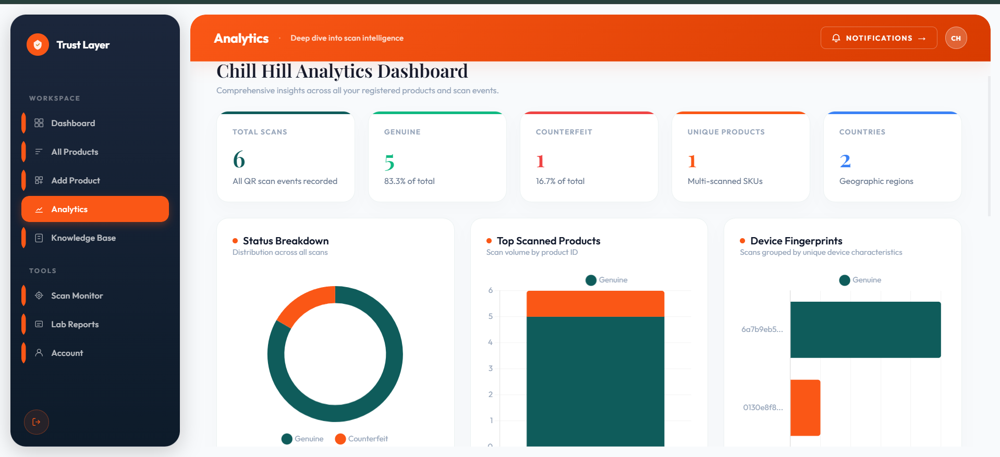
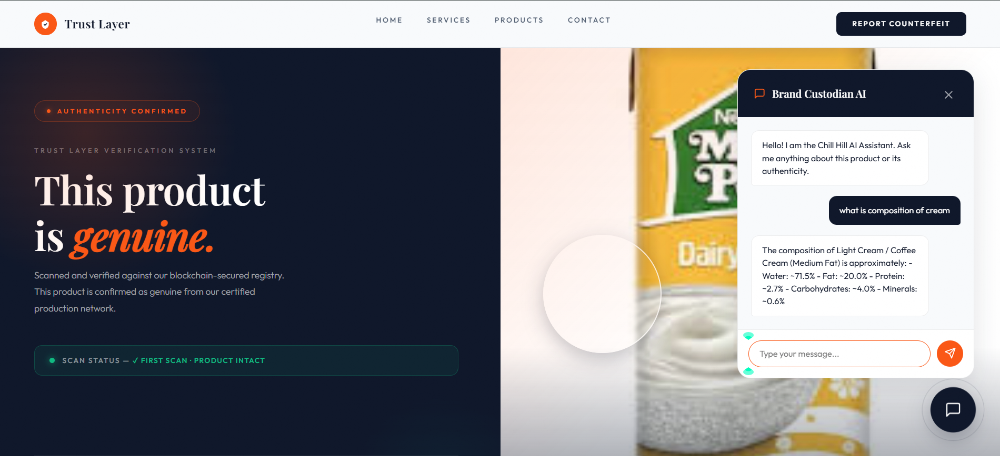
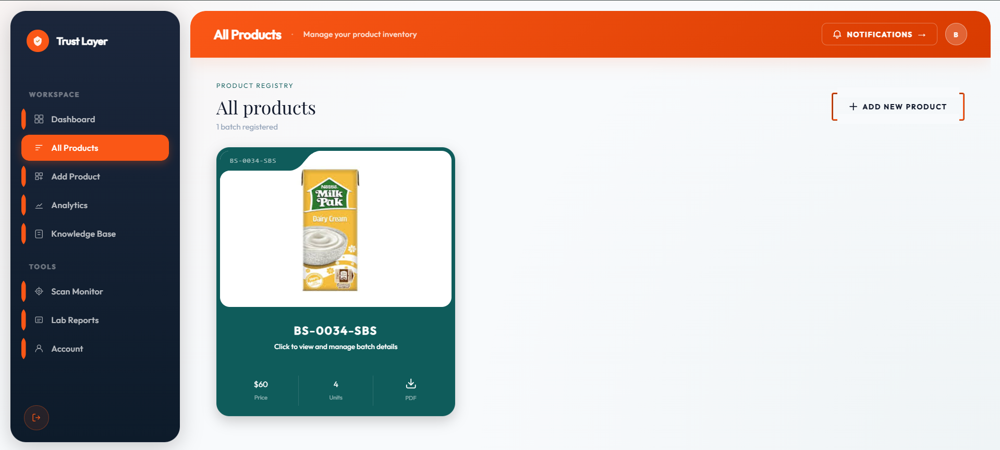
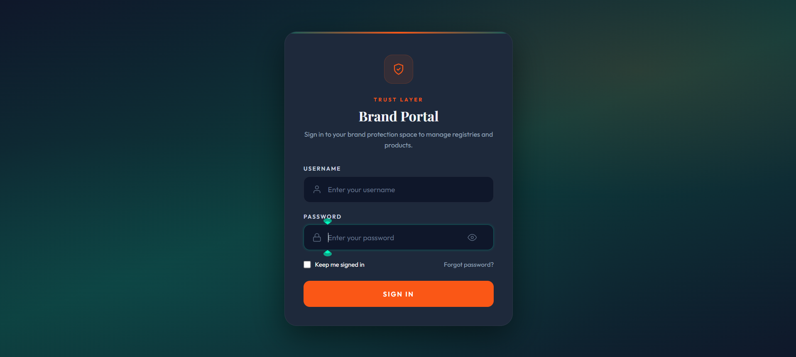
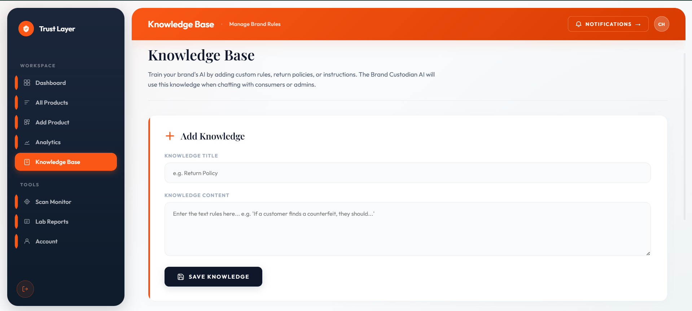
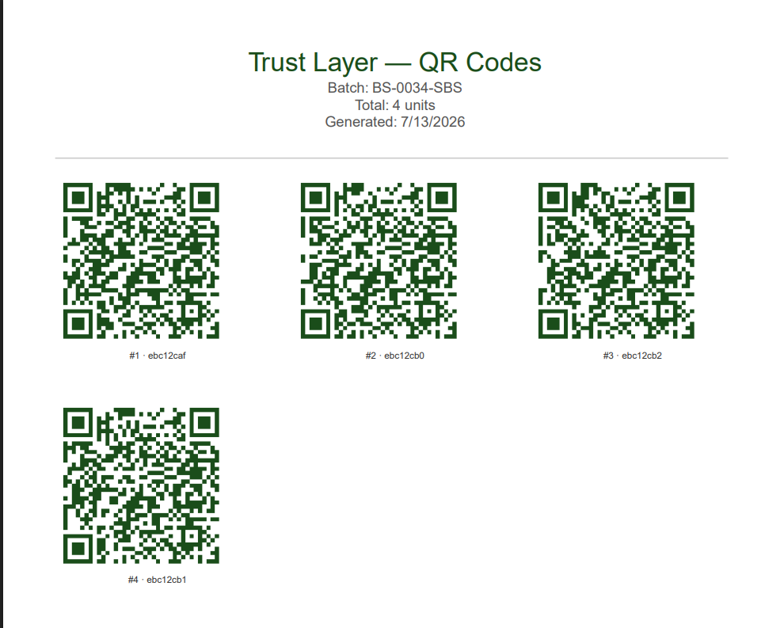

<div align="center">
  
  <h1>Trust Layer</h1>
  <p><strong>Counterfeit-proof your products, protect your reputation.</strong></p>
  
  <p>
    
    
    
    
  </p>
</div>

---

## 🌟 Overview

**Trust Layer** is an anti-counterfeit product verification platform that uses QR code technology to let consumers verify product authenticity instantly, and lets brand owners protect their products, track scans, and now answer customer questions through an AI-powered assistant.

## ⚠️ Problem It Solves

Counterfeit products cost brands revenue and trust, and consumers have no easy way to verify if what they bought is genuine. Trust Layer solves this through three core pillars:

1. **Authentication** — verify a product is genuine at the point of scan
2. **Ownership Detection** — flag duplicate/counterfeit scans automatically
3. **Recall Notifications** — instantly notify affected customers if a product is recalled

---

## 📸 Platform Gallery

<div align="center">
  
</div>

<br>

| Analytics Dashboard | AI Product Assistant |
|:---:|:---:|
|  |  |

| Batch Management | Brand Authentication |
|:---:|:---:|
|  |  |

| Knowledge Base | Generated QR Sheets |
|:---:|:---:|
|  |  |

---

## 🚀 Getting Started

Follow these instructions to set up the project locally on your machine.

### Prerequisites
- **Node.js** (v16.x or higher)
- **MongoDB** (Local instance or MongoDB Atlas URI)
- **Git**

### Installation

1. **Clone the repository**
   ```bash
   git clone https://github.com/callmeeman45-dotcom/Trust-Layer.git
   cd Trust-Layer
   ```

2. **Install dependencies**
   ```bash
   npm install
   ```

3. **Configure Environment Variables**
   Create a `.env` file in the root directory and add your credentials:
   ```env
   PORT=3000
   mongodb_cloud_address=your_mongodb_connection_string
   CLOUDINARY_CLOUD_NAME=your_cloudinary_name
   CLOUDINARY_API_KEY=your_api_key
   CLOUDINARY_API_SECRET=your_api_secret
   FIREWORKS_API_KEY=your_fireworks_api_key
   ```

4. **Run the Application**
   ```bash
   npm start
   ```
   Open your browser and navigate to `http://localhost:3000`.

---

## 📁 Folder Structure

```text
Trust-Layer/
├── models/             # Mongoose schemas (Product, ScanRecord, Admin, etc.)
├── public/             # Static assets (CSS, Images, Client-side JS)
│   ├── css/            # Custom styling and layout logic
│   └── images/         # Logos and UI assets
├── routes/             # Express route handlers
├── views/              # EJS templates (Dashboard, Analytics, Auth)
│   └── partials/       # Reusable components (Sidebar, Topbar)
├── app.js              # Entry point & Server configuration
├── .env                # Environment variables (Ignored in Git)
├── package.json        # Project metadata and dependencies
└── README.md           # Project documentation
```

---

## ⚙️ How the System Works (End-to-End)

1. **Brand owner registers a product** via the dashboard. The backend dynamically generates a cryptographically secure hash using Node.js `crypto`.
2. **QR Code Generation**: This hash is embedded into a verification URL, which is dynamically converted into a scannable QR code matrix using the `qrcode` library.
3. **Storage & Printing**: A printable PDF sheet containing these generated QR codes is instantly assembled and uploaded to **Cloudinary**, ready for manufacturing and packaging.
4. **Consumer scans the QR code** on the product.
4. **First scan** → the system records this as the legitimate "ownership" event, tagging the scan with a **UUID stored in a cookie** on the user's device (replacing older IP-based tracking, which was unreliable behind shared networks/VPNs).
5. **Subsequent scans** of the same QR code (e.g., from a different device/location) are automatically flagged as **potential counterfeits**, since a genuine product should only be "claimed" once.
6. **Every scan event** (timestamp, device UUID, IP, location) is logged and visualized on an **analytics dashboard** for the brand owner.
7. **Brand owners can also add product knowledge** (ingredients, usage, warranty, etc.), which feeds the **RAG-based AI assistant** so consumers can ask questions about the product directly after scanning.
8. If a product is **recalled**, the system pushes recall notifications to users who scanned that batch/product.

---

## ✨ Core Features

### 1. QR Code Generation & Ownership Verification
- Unique QR code generated per product unit
- First-scan-owns logic: first scan = legitimate owner, later scans = flagged as suspicious
- QR images and PDFs stored via **Cloudinary**

### 2. Device Tracking
- UUID-based cookie tracking per device (replacing IP-based tracking for better reliability)
- Prevents easy spoofing compared to IP-only detection

### 3. Analytics Dashboard
- Built with **Chart.js**
- Visualizes scan activity, with **IP/device hover tooltips**
- Dark **navy/teal/orange** design system

### 4. Email & Contact System
- **Nodemailer** integrated with **Gmail SMTP**, deployed on **Vercel**
- Contact form section wired to its own Nodemailer backend for inquiries

### 5. AI-Powered Product Assistant (RAG)
A Retrieval-Augmented Generation (RAG) system that lets brand owners feed in detailed product information, and lets end users ask natural-language questions about that product after scanning its QR code.

---

## 🤖 AI-Powered Product Assistant Deep-Dive

### How It Works

1. **Brand owners add product knowledge**: Owners input product details — ingredients, usage instructions, warranty terms, manufacturing info, storage guidelines, FAQs, etc.
2. **Data gets embedded and stored per brand**: Each piece of product info is converted into vector embeddings and stored in a vector database, scoped by `brandId`. This ensures one brand's data is never mixed with or leaked into another brand's responses.
3. **Users query naturally**: After scanning a QR code, users can ask questions like:
   - "Is this safe for sensitive skin?"
   - "What's the expiry date policy?"
4. **Retrieval + generation**: The system retrieves the most relevant chunks of that brand's product data (via similarity search) and passes them to an LLM via the **Fireworks API**, which generates a grounded, accurate answer — no hallucinated product claims.

### Why It Matters
- Builds consumer trust by giving instant, verified answers straight from the manufacturer.
- Reduces support queries to brand owners.
- Adds another layer of legitimacy — counterfeit products won't have real backing data to answer against.

---

## 🛠️ Tech Stack

-  **EJS, Vanilla CSS & JS**: For rendering a premium, glassmorphism-inspired user interface.
-  **Node.js & Express**: Handling robust API endpoints and server-side logic.
-  **MongoDB**: Storing scan records, product data, and brand credentials.
-  **Cloudinary**: Managing image and PDF assets.
-  **Chart.js**: Rendering real-time dynamic charts for scan tracking.
-  **Nodemailer (Gmail SMTP)**: Used for handling contact forms and email triggers.
-  **Fireworks API**: Powering lightning-fast LLM inference and Retrieval-Augmented Generation (RAG) for the AI Product Assistant.
-  **Vercel**: Seamless and scalable production deployment.

---

## 🔐 Brand Account Access Model

Trust Layer does not support open, public self-registration for brand accounts. This is a deliberate security measure to prevent unauthorized parties from issuing fraudulent verification for products they don't own.

**How it works:**
1. A prospective brand submits a verification/onboarding request (outside the platform, e.g. via contact form or direct outreach).
2. Trust Layer's team manually verifies the brand's legitimacy (business registration, product ownership, etc.).
3. Only the Super Admin can approve a request and provision a verified Brand Admin account on the platform.
4. Once created, the Brand Admin can log in and manage their own product QR codes, view analytics, and issue recall notifications — scoped strictly to their own brand's data.

This closed-registration model is core to Trust Layer's trust guarantee: every brand account on the platform has been vetted, so a "verified" badge actually means something to end consumers.

---

## 🎮 Demo Access

For testing/demo purposes, a pre-verified Super Admin account is available:

| Field | Value |
|---|---|
| Username | `Abbott Admin` |
| Password | `ABBOTT` |

**Note:** These are demo credentials for evaluation purposes only. Do not use in production, and rotate/remove before any public deployment.

---

## 👥 Our Team

Trust Layer was brought to life by a dedicated team of developers and innovators under expert supervision:

### Supervisor
- **Zeeshan Asif**

### Development Team
- **Hafiz Zubair Akram**
- **Eman Fatima**
- **Saman Khalid**
- **Iqra Fatima**

---

<div align="center">
  <p>Built with ❤️ by the Trust Layer Team</p>
</div>
